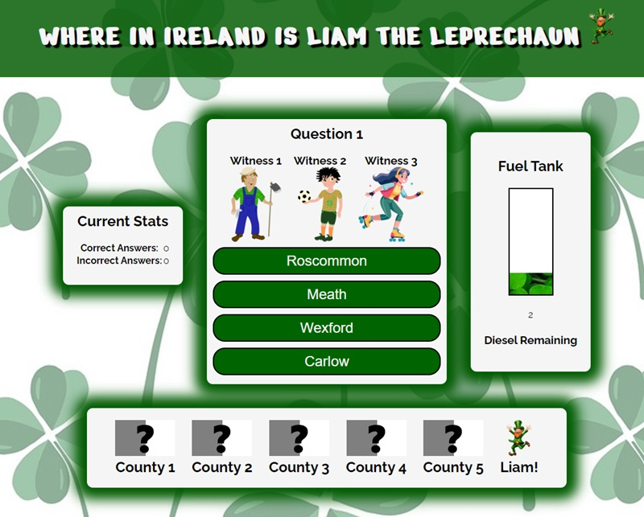

# Where in Ireland is Liam the Leprechaun Game

## Index - Table of Contents
* [Introduction](#introduction)
* [User Experience (UX)](#user-experience-ux) 
    * [User Goals](#user-goals) 
* [Design](#design)
    * [Colour](#colour)
    * [Fonts](#fonts)
    * [Wireframes](#wireframes)
* [Features](#features)
    * [Title](#title)
    * [Introduction](#introduction---home-screen)
    * [How To Play Section](#how-to-play-section)
    * [Main Question Display](#main-question-display)
        * [Hint and Answer Section](#hint-and-answer-section)
        * [Fuel Gauge](#fuel-gauge)
        * [Route](#route)
        * [Feedback Displays](#feedback-displays)
            * [Correct/Incorrect Answers](#correct-answerincorrect-answer)
        * [Current Statistics](#current-statistics)
    * [Future Features](#future-features)
* [Technologies Used](#technologies-used)
    * [Languages](#languages)
    * [Frameworks, Libraries and Programs Used](#frameworks-libraries--programs-used)
* [Testing](#testing)
    * [Validator Testing](#validator-testing)
    * [Lighthouse Testing](#lighthouse-testing)
    * [Additional Manual Testing](#additional-manual-testing)
    * [Browser Compatibility](#browser-compatibility)
    * [Bugs](#bugs)
    * [Known Bugs](#known-bugs)
* [Deployment](#deployment)
    * [How This Site Was Deployed](#how-this-site-was-deployed)
    * [How to Clone The Repository](#how-to-clone-the-repository)
* [Credits](#credits)
    * [Photos](#photos)
    * [Code](#code)
    * [Acknowledgments](#acknowledgments)

## Introduction
Where in Ireland is Liam the Leprechaun is an educational game aimed at teaching children facts about the counties of Ireland. 

The overall goal of this game is help find Liam the Leprechaun who has absconded from Dublin with the legendary pot of gold from beneath the magical rainbow. The user will start their journey in Dublin where they will encounter witnesses bearing clues as to which county Liam traveled to next. With each correct response, the user moves a step closer to Liam and recovering the pot of gold. 

The game targets primary school children (ages 8-12) who are looking to learn about and test their knowledge of Ireland. However, older children and adults could also benefit from playing!   

## User Experience (UX)

### User Goals
 As a User, I want to:
   - easily understand the purpose of the site.
   - easily view instructions on how to play the game.
   - easily and intuitively interact with the game.
   - be able to see how many questions I have remaining.
   - be able to see how many attempts I have left. 
   - be able to easily see the result of the game and be able to play again.

## Design

### Colour
The colour scheme for this website is mainly green with black and white accents. The green colour was extracted from the background image using Microsoft Paint and used throughout the site. The colour scheme helps to provide a vibrant site that reminds the user of Ireland. 

### Fonts
Google Fonts was used to import the Nerko One and Raleway fonts. These were chosen as they complement each other well and have a simple and playful aesthetic. 

### Wireframes

Introduction Screen

How to Play Screen

Main Quiz Screen

Game Win Screen

Game Over Screen

## Features

### Title
- The title contains white font on a green background to keep with the Irish theme and provide good contrast.
- The text is capitalized and a black shadow was utilized to make it further stand out against the background.
- A small image of a leprechaun was added to emphasize the title and theme. 

### Introduction - Home Screen
- The home screen contains the title of the game as well as a small introduction to what the game is about. The design is simple with a background containing green clovers, in keeping with the overall theme. The background and styling are simple to not distract from the game. The introduction screen contains an image of a pot of gold under a rainbow to symbolize the pot of gold stolen by Liam the Leprechaun. There is a single button on this page that will lead the user to the game rules. 
 

### How to Play Section
- The How to Play Section informs users of the basics of the game and what they need to do in order to find Liam and retrieve the pot of gold. It clearly states what happens if they answer correctly or incorrectly. 
- This page also contains a start button - labeled as 'Save the Emerald Isle' in keeping with the theme. This button will remove the 'How to Play' section from the screen and display the main game question screen.  

### Main Question Display
- The main display contains several sections that are hidden and revealed throughout the game using a CSS 'hide' class that is removed and added via javascript functions that are linked with event listeners. The overall theme of this section is consistent with the rest of the game, with the same background and title visible to the player. 
 

### Hint and Answer Section
- The hint section contains three images that are labeled as Witness 1, Witness 2, and Witness 3. Rather than just having clues or questions written on the screen, I felt it engaged the user more to have to "interact" with these witnesses to get the hints needed to solve where Liam went. 
- When you click on a witness a Javascript function to play the appropriate audio file is triggered via an event listener. The hint is then displayed in text and played via an audio file. 

#### Fuel Gauge
- The fuel gauge is used to keep the user's score. It increases each time a question is answered correctly and decreases each time the question is answered incorrectly. 
- If the fuel gauge reaches 0 the game is over.
- A picture of a field of clovers was used to fill the fuel gauge to enhance the Irish theme.

#### Route 
- The route section contains 5 "mystery flags" when you start the game. 
- As a player correctly identifies each county along the way, that county's flag will populate along the route. 
- This serves as a nice visual to show the user's progress and let them know how far they have to go to capture Liam. 

#### Feedback Displays
- The game contains several other display containers that give the user feedback on their progress:

##### Correct Answer/Incorrect Answer
- After a user selects an answer, either the correct or incorrect answer container appears. These containers are styled with a bright green (correct) or bright red (incorrect) border to add to the visual effect. Each container is also equipped with a button to either return the user to the question to try again or proceed to the next county accordingly. 

#### Current Statistics
- The current statistics section gives the user a snapshot of how many times they've guessed correctly vs incorrectly throughout the game. 

### Future Features
In the future, this game could be further developed to include the following:
   - A randomizer that creates new routes each time the game is played.
   - A timer feature that allows Liam to get further away depending on how long the player takes to traverse the counties. 

## Technologies Used

### Languages
- HTML
- CSS
- Javascript

### Frameworks, Libraries & programs Used
- [Google Fonts](https://fonts.google.com) was used for the fonts: Oswald and Lato.
- [Font Awesome](https://fontawesome.com/) was used for various icons in the footer and headings of the pages. 
- [Balsamiq](https://balsamiq.com/) was used to create the wireframes.
- [TTSMaker](https://ttsmaker.com/) was used to create the audio files for the hints. 

## Testing

### Validator Testing
- [HTML Validator](https://validator.w3.org/)

  - Result for index.html
 

  - Full Validation Results available:
    - <a href="https://github.com/michelleduda/whereisliamleprechaun/blob/main/documentation/validation-results/html-validation-index.pdf" target="_blank">HTML Results - Home Page</a>
 
- [CSS Validator](https://jigsaw.w3.org/css-validator)
  - Result for style.css
 

  - Full Validation Results available:
    - <a href="https://github.com/michelleduda/whereisliamleprechaun/blob/main/documentation/validation-results/css-validation-results.pdf" target="_blank">CSS Results</a>

- [Javascript Validator](https://jshint.com)
  - Code from script.js passed through JSHint site with no errors. The following Metrics were logged: There are 9 functions in this file. Function with the largest signature take 1 arguments, while the median is 0. Largest function has 33 statements in it, while the median is 10. The most complex function has a cyclomatic complexity value of 8 while the median is 1.

### Lighthouse Testing
- Lighthouse results for index.html

 

### Additional Manual Testing

| ID                         | Feature Tested                             | Steps                                                                                                                                                        | Expected Outcome                                                                                                                                                                                                           | Results           |
| -------------------------- | ------------------------------------------ | ------------------------------------------------------------------------------------------------------------------------------------------------------------ | -------------------------------------------------------------------------------------------------------------------------------------------------------------------------------------------------------------------------- | ----------------- |
| Home/Introduction   Screen |                                            |                                                                                                                                                              |                                                                                                                                                                                                                            |
| T01                        | UX - Title                                 | Open main page at michelleduda.github.io/whereisliamleprechaun/ and visually check that Title and Leprechaun icon appear. Check positioning and readability. | Text is legible and positioned properly.  A Leprechaun image appears.                                                                                                                                                        | Works As Expected |
| T02                        | UX - Introduction Text                     | Visually check that the introduction text appears properly on the screen.                                                                                        | Text is legible and positioned properly.                                                                                                                                                                                   | Works As Expected |
| T03                        | Interaction - How to Play Button           | Click on How to Play button.                                                                                                                                 | Hides introduction container and displays rules container.                                                                                                                                                                 | Works As Expected |
| How to Play/Rules Screen   |                                            |                                                                                                                                                              |                                                                                                                                                                                                                            |
| T04                        | UX - Rules Text                            | Visually check that rules display properly on the screen. Ensure that text stays within the white box on various screen sizes.                                       | Text is legible and positioned properly.                                                                                                                                                                                   | Works As Expected |
| T05                        | Interaction - Save the Emerald Isle Button | Click on Save the Emerald Isle Button                                                                                                                        | Hides rules container and displays main game screen with all containers at default values.                                                                                                                                 | Works As Expected |
| Quiz Section               |                                            |                                                                                                                                                              |                                                                                                                                                                                                                            |                   |
| T06                        | Interaction - Hint Display                 | Click on each witness on each question                                                                                                                       | Clicking on each witness will display hint text below the image as well as play an audio file that reads the text. Each witness will have a different hint that appropriately corresponds to the county in question.       | Works As Expected |
| T07                        | Interaction - Correct Answer               | Click on the correct answer on each question.                                                                                                                | The question screen will become hidden and the container indicating a correct response will appear.                                                                                                                        | Works As Expected |
| T08                        | Interaction - Correct  Answer              | Click on the Proceed to Next County Button in the correct answer container for each question.                                                                | The correct answer container will be hidden and the main game screen will reappear. The fuel gauge will be increased by 1, the route container will be updated with the appropriate county flag, and a new question will load. | Works As Expected |
| T09                        | Interaction- Incorrect Answer               | Click on each incorrect answer on each question.                                                                                                             | The question screen will become hidden and the container indicating an incorrect response will appear.                                                                                                                     | Works As Expected |
| T10                        | Interaction - Incorrect  Answer            | Click on the 'Try Again' button in the incorrect answer container for each question.                                                                         | The incorrect answer container will be hidden and the main game screen will reappear. The fuel gauge will be decreased by 1 and the same question will load again.                                                         | Works As Expected |
| T11                        | UX - Current Stats                         | Click on Correct and Incorrect Answers                                                                                                                       | The count of correct answers and incorrect answers will increment accordingly.                                                                                                                                             | Works As Expected |
| Game Win/Game Over Screens |                                            |                                                                                                                                                              |                                                                                                                                                                                                                            |
| T12                        | UX - Game Over                             | Click on an incorrect answer with only 1 fuel remaining                                                                                                      | Main game screen will be hidden and the 'Game Over' container will appear.                                                                                                                                                 | Works As Expected |
| T13                        | Interaction- Game Over                     | Click on Try Again Button                                                                                                                                    | The 'Game Over' container will be hidden and the main game screen will reappear. Current stats, flags, and fuel gauge will all be reset to default values. The first question will appear on the screen.                   | Works As Expected |
| T14                        | UX - Game Win                              | Click on the correct answer for the final question.                                                                                                          | The main game screen will be hidden and the 'Game Won' Container will be displayed.                                                                                                                                        | Works As Expected |
| T15                        | Interaction - Game Win                     | Click on Play Again Button                                                                                                                                   | The 'Game Won' container will be hidden and the main game screen will reappear. Current stats, flags, and fuel gauge will all be reset to default values. The first question will appear on the screen.                    | Works As Expected |
| T16                        | UX - Responsiveness                        | Repeat all above tests for various screen sizes: a. Desktop 1920 x 1080 b. Laptop 1366 x768 c. Tablet 820 x 1180 d. Mobile Phone 424 x 896       | Repeat the above tests on various screen sizes.                                                                                                                                                                                 | Works As Expected |

### Browser Compatibility
This website was tested on the following browsers:
- Google Chrome Version 127.0.6533.89 (Official Build) (64-bit)
- Microsoft Edge Version 127.0.2651.86 (Official build) (64-bit)
- Mozilla Firefox Version 128.0.3 (64-bit)

### Bugs
1. The game-over-container remained on the screen after selecting to play again. Fixed by adding gameOverContainer.classList.add('hide') to the resetGame function. 
2. Flags in route-container were not defaulting back to the mystery flags when a user selected to play again after completing the game. Fixed by adding code to reset all of route-container image sources to mysteryflag.jpg if currentLocation is equal to 0. 
3. HTML validator returned error: Bad value for attribute src on element audio. Must be non-empty. Fixed by creating a default audio file and applying to audio element on index.html.

### Known Bugs
There are no unaddressed known bugs at this time. 

## Deployment

### How This Site Was Deployed

This site was deployed via GitHub
1. Log into [GitHub](https://github.com).
2. Navigate to the repository [MichelleDuda/whereisliamleprechaun](https://github.com/MichelleDuda/whereisliamleprechaun).
3. Navigate to the [Settings Tab](https://github.com/MichelleDuda/whereisliamleprechaun/settings).
4. Click on the [Pages](https://github.com/MichelleDuda/whereisliamleprechaun/settings/pages) option in the left-hand pane. 
5. Select the main branch from the source dropdown menu.
6. Once the main branch has been selected the page will refresh automatically with a ribbon displaying that the deployment has been successful.
7. Any changes pushed to the main branch will now take effect in the live project. 

Link to the live project: [Where is Ireland is Liam the Leprechaun](https://michelleduda.github.io/whereisliamleprechaun/index.html)

### How to Clone the Repository

To Clone this repository:
1. Navigate to [https://github.com/MichelleDuda/whereisliamleprechaun](https://github.com/MichelleDuda/whereisliamleprechaun).
2. Click on the "<> Code" button.
3. Copy the URL for the repository using HTTPS, SSH, or GitHub CLI. 
4. Open Git Bash.
5. Change the working directory to the location you want to clone the directory to. 
6. Type git clone and paste the URL that was copied earlier. 
7. Press Enter to begin the clone process. 

## Credits

### Photos

1. [background.webp](https://pixabay.com/illustrations/clover-leaf-pattern-repetition-8108105/) by Martin Hetto from Pixabay.
2. [energy.jpg](https://www.pexels.com/photo/top-view-photo-of-clover-leaves-158780/) from Pixabay.
3. [farmer.jpg](https://pixabay.com/vectors/farmer-rural-worker-agriculture-148325/) by OpenClipart-Vectors from Pixabay.
4. [footballer.jpg](https://pixabay.com/vectors/footballer-football-sport-game-boy-1204089/) by grafikacesky from Pixabay.
5. [fuelempty.jpg](https://pixabay.com/photos/fuel-petrol-gas-gauge-empty-full-2741/) by PublicDomainPictures from Pixabay.
6. [leprechaun.png](https://pixabay.com/illustrations/leprechaun-irish-green-lucky-8616702/) by Gooseflats from Pixabay.
7. [smallleprechaun.png](https://pixabay.com/illustrations/leprechaun-irish-green-lucky-8616702/) by Gooseflats from Pixabay.
8. [woman.png](https://pixabay.com/vectors/princess-queen-crown-dress-girl-1196654/) by grafikacesky from Pixabay.
9. potofgold.webp created using OpenAI's DALL·E, created with assistance from ChatGPT.
10. cork.jpg, donegal,jpg, kerry.jpg, meath.jpg, waterford.jpg were all created by Michelle Kelly using Microsoft Paint. 

### Code

1. Code for using an event listener on a class is adapted from [Stackoverflow.com](https://stackoverflow.com/questions/19655189/javascript-click-event-listener-on-class).
2. Use of event.target.id is adapted from [Coreui.io](https://coreui.io/blog/how-to-get-element-id-in-javascript/). 
3. Code for dymanically updated audio source based on which witness image the user selects is adapted from [Stackoverflow.com](https://stackoverflow.com/questions/10792163/change-audio-src-with-javascript).
4. [TabletoMarkdown.com](https://tabletomarkdown.com/convert-spreadsheet-to-markdown/) was used to convert my additional manual testing table from an excel spreadsheet to markdown. 

### Acknowledgments

1. My mentor Dick Vlaanderen for all his helpful advice, guidance, and support.